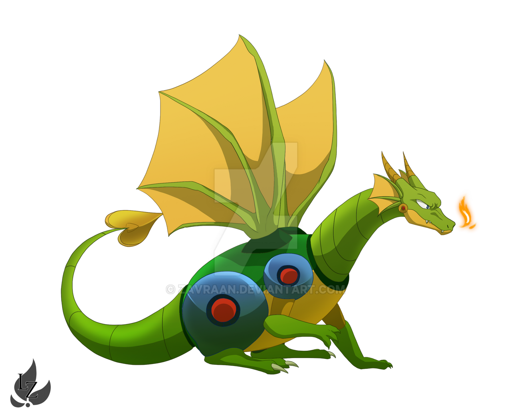

# Team Story Challenge

This is the starting draft of your team’s story.  
Your mission: **revise and improve it**, making it coherent, funny, and illustrated with the provided images.

---

## Our Wonderful Story

1. Once upon a time, there was a **castle**.
  
   High on a misty hill stood the magnificent Castle Cloudpeak, where the royal family kept their most prized possession. 

   
   

2. Then suddenly, a **dragon** appeared… but maybe it was actually a **robot**?  
   (Nobody is sure yet.)

   One Tuesday morning, a massive creature landed in the courtyard with a thunderous CLANG! It breathed fire like a dragon, but its scales were suspiciously shiny and made beeping sounds.

   

3. The scientist shouted something very important but nobody wrote it down.

   Professor Bumblebottom rushed out waving her clipboard frantically. "THE SOLUTION IS OBVIOUSLY—" she yelled, but at that exact moment, the castle bell rang for lunch. Everyone left. The professor stood there, disappointed, still holding her unheard answer to everything.

   

4. After that, everyone got lost (or maybe teleported?) and somehow there was a **treasure chest**…

   When they returned from lunch, the castle was completely empty. In the middle of the throne room sat a glowing treasure chest with a note: "Congratulations! You've been randomly selected for an adventure. No refunds." The robot-dragon was gone. This was getting weird.
 
   

5. Someone found a map, but it had no directions.  
   (TODO: add an image of the map?)  

6. “Let’s go to space!” shouted the pirate (although there was no pirate before this).  

7. A rocket blasted off, but at the same time the **time machine** broke down.  

8. The cat was supposed to talk here, but the line is missing.  

9. In the forest, the detective discovered… something.  
   (What did they find?)  

10. The ending… well, we don’t really have one. Please fix this.
